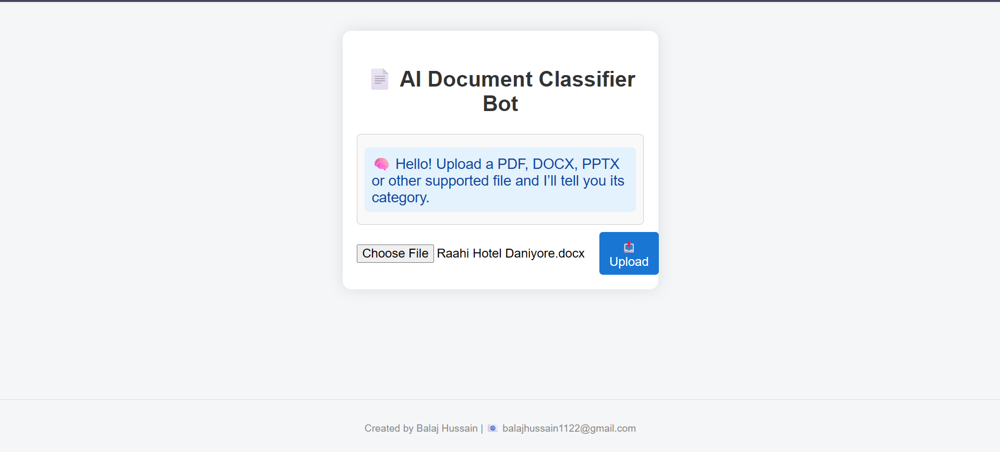

# 🧠 AI Document Classifier with Chatbot

This project is an AI-powered web application built with **Flask** and **Python** for automatic document classification and interactive chat-based querying. Upload your documents (PDF, DOCX, PPTX, XLSX, and more) and have them instantly categorized as Legal, HR, Finance, Medical, or Technical.

---

## 📁 Project Structure

```
product-chatbot/
│
├── classifier_real.py         # Main Flask API, file handling, and classification logic
├── model.pkl                  # Trained machine learning classifier model
├── vectorizer.pkl             # TF-IDF (or other) vectorizer used during model training
│
├── templates/
│   └── index.html             # Web frontend interface
│
├── static/
│   └── style.css              # Custom frontend styling
│
├── uploads/                   # Temporary folder for user-uploaded files
│   └── (kept empty)
│
└── README.md                  # Project documentation (this file)
```

---
##> **Note:**  
> This project was developed and tested using **Python 3.10+** in **Visual Studio Code**.<br>
> It is highly recommended to use **Python 3.8–3.10** for maximum compatibility.
>
> **Key library versions used:**
> - Flask **2.3+**
> - scikit-learn **1.3+**
> - pandas **1.4+**
> - joblib **1.2+**
> - python-docx **0.8.11+**
> - python-pptx **0.6.21+**
> - PyPDF2 **3.0+**
> - openpyxl **3.1+**
> - xlrd **2.0.1+**
> - striprtf **0.0.15+**
> - odfpy **1.4.1+**
>
> **IDE:** Visual Studio Code (VS Code)  
> **Test Environment:** Windows 10, local development server
>
> ⚠️ Ensure your Python version is compatible with these libraries.<br>
> If you face any installation or runtime issues, use a virtual environment and refer to each package’s official documentation.

## ⚙️ Setup Instructions

1. **Clone this repository:**

   ```bash
   git clone https://github.com/your-username/product-chatbot.git
   cd ai-doc-classifier-chatbot-main
   ```

2. **Create and activate a virtual environment:**

   ```bash
   python -m venv venv
   # On Windows:
   venv\Scripts\activate
   # On Mac/Linux:
   source venv/bin/activate
   ```

3. **Install dependencies:**

   If you have a `requirements.txt`:
   ```bash
   pip install -r requirements.txt
   ```

   If not, install these packages manually:
   ```bash
   pip install flask python-pptx python-docx PyPDF2 pandas openpyxl xlrd striprtf odfpy joblib scikit-learn
   ```

4. **Model Files:**

   Ensure the following files are present in your project root:
   - `model.pkl`
   - `vectorizer.pkl`

   If you do not have them, train your own model or download the provided files.

---

## 🚀 Running the App

```bash
python classifier_real.py
```

The app will start at: [http://127.0.0.1:5001](http://127.0.0.1:5001)

---

## 📤 Supported File Formats

- `.pdf`
- `.docx`
- `.pptx`
- `.xlsx`, `.xls`
- `.rtf`
- `.odt`, `.ods`

---

## 🧠 Model Information

- **Categories:** Legal, HR, Finance, Medical, Technical
- **Method:** Supervised machine learning (e.g., Logistic Regression / SVM)
- **Text Representation:** TF-IDF vectorization
- **Classifier:** Built with [scikit-learn](https://scikit-learn.org/)

---

## ✍️ Author

**Balaj Hussain**  
📧 balajhussain1122@gmail.com

---
